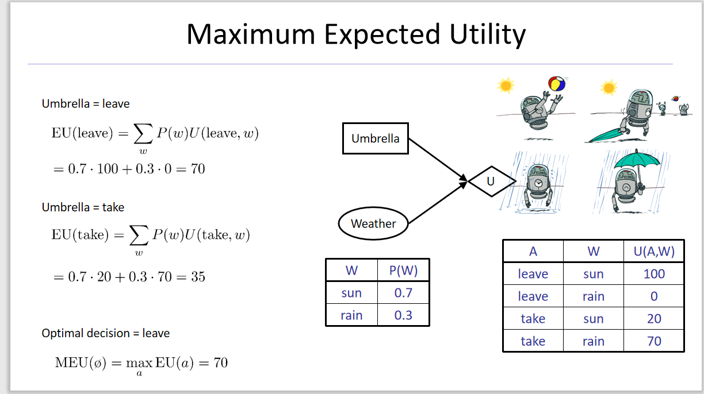
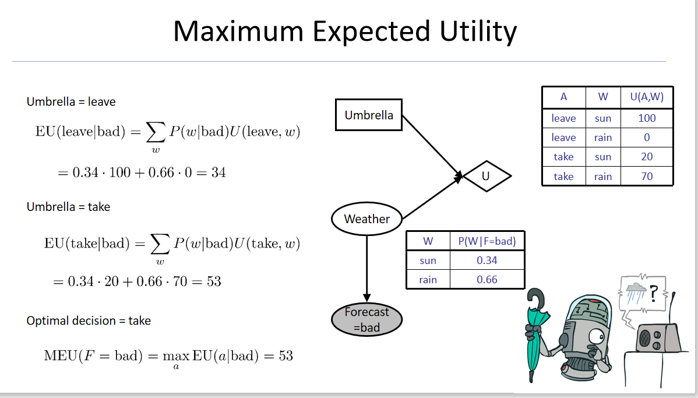
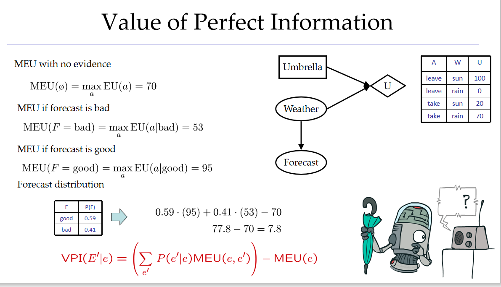
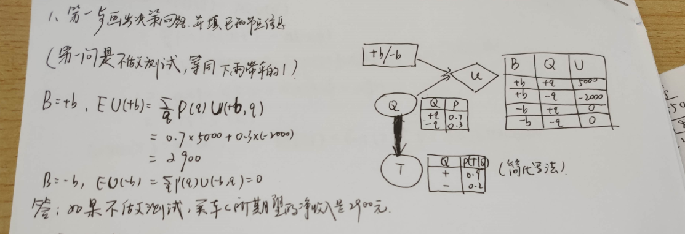
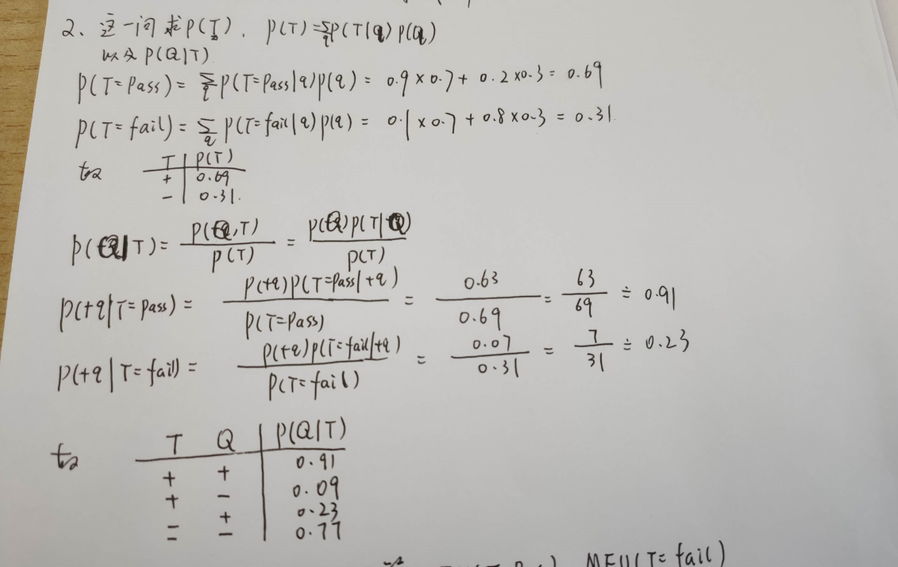
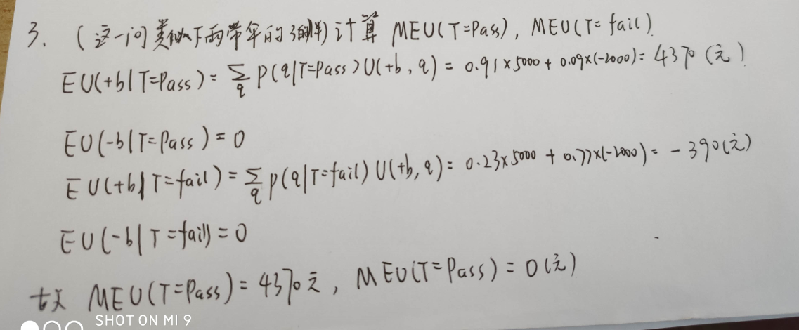
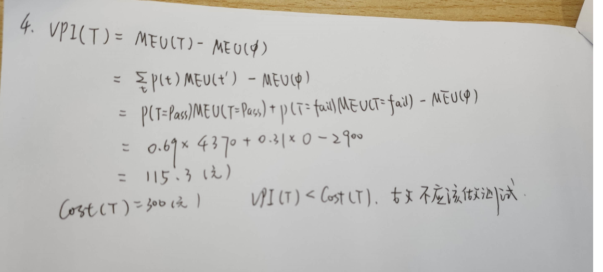

# 人工智能决策网络

**杂谈**：就是在概率的基础上加了权值，求一个数学期望。计算的时候，有些地方可以剥离开来，先将U的父节点那里算清楚，再结合操作，计算最终的数学期望。

## 一，下雨带伞一例

### 1.父节点非常简单，只有先验概率

### 2.父节点稍微复杂，有一个影响他的子节点（但是子节点是常量），条件概率

### 3.进一步升级，子节点是变量。（引入了一个信息价值的概念）

## 二，二手车一例

### 题目：

一辆车的车况可能有好（Q=+q）,有坏（Q=-q）,所以二手车收购员购买车前需要进行不同的测试（测试可能需要花费一定的费用），然后依据不同的测试结果决定是否购买。假设一个收购员买车的时候时间只够进行一项测试（需花费300员），这项测试能够帮助他弄清楚车的近况。测试结果可能是T：通过（T=pass）或没通过（T=fail）。一辆车c的价值是一万5千元。而如果车况好，市场价格是2万元，如果车况不好，需要花费7千元修理费把车调整到好的车况。据估计，c车车况好的概率是70%。

### 1.如果不做测试，买车c所期望得到的净收入是多少？

**杂谈**：做这类题先要画出决策网络，Q，T之间弧的方向可以随便。

首先根据收益，找到决定它的父节点，Action(Buy),Effect(直接影响，这里是Quality,车况)。画出收益表。

其次，Q的先验概率已经给出，可以画在旁边。有了这些信息第一题就可以做了。

 

### 2.假设测试结果的概率分布如下：

P（T=pass|Q=+q）=0.9

P（T=pass|Q=-q）=0.2

计算车辆通过/不通过检测的概率，以及测试后车况好坏的概率

**杂谈**：其实测试，明显要作为一个Evidence，但是题干没有直接给出。所以需要我们计算。这里，只看Q->T,Q已知，T在Q的条件概率也已知，可以计算出P（T）的分布列。其次第二小问，问的是测试后的车况，明显是一个条件概率，P（Q|T）,应用公式计算即可。

有一个小技巧就是“算一半”，因为这里随机变量取值是布尔型，另一半可以直接用一减。

### 3.计算测试后的最优方案，以及期望收益

**杂谈**：测试后的最优方案，由于测试后的结果有两个pass,fail所以这里应该计算MEU（T=pass）,MEU(T=fail)。

可以得出结论：如果测试通过，就买，期望收益是4370；

测试不通过，就不买，期望收益是0；

### 4.计算VPI，并决定是不是应该做测试。

**杂谈**：VPI的性质上课讲过很多，但是这里只需要明确，信息的价值=有它的收益-没它的收益。

这里的信息指的是测试的结果，由于是随机变量T，所以要加权。

